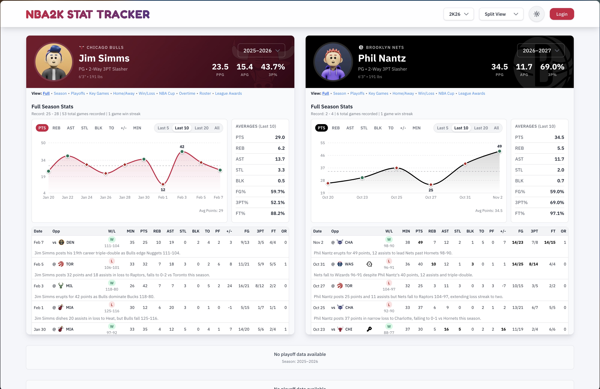

# 🏀 NBA2K Career Stats Compared

A full‑stack stat‑tracking app built to record, compare, and visualize NBA 2K MyCareer statistics over multiple seasons. Born out of the frustration that 2K doesn't retain all stats across games, this project preserves career data that would otherwise be lost and turns it into side‑by‑side performance trends.

It's a real, actively‑used app — my friend and I have logged our MyCareer stats here across seasons — but it's also public: anyone can visit the live site and browse the stats and playoff history in read‑only mode. I'm sharing it here as a portfolio piece to show how it's built.

**Live site:** [https://nba.rtpdreamteam.com](https://nba.rtpdreamteam.com)



## Features
- **Public read‑only viewing** - anyone can browse both players' stats, trends, and playoff history without an account
- **Two-user authentication** via Supabase Auth, gating edit access to each player's own data
- **Game management** - Add, edit, and delete individual game statistics
- **Comprehensive stat tracking** - Points, rebounds, assists, shooting percentages, and more
- **Side-by-side stat comparison** with dynamic stat tables
- **Game trend charts & tables** - Visualize performance over the last 5/10/20 games or a full season
- **Season totals** - Manual entry or automatic calculation from games
- **Career highs** tracking and manual override
- **League awards** management, surfaced alongside season stats
- **Playoff bracket visualization** with seeds and full tournament structure

## Tech Stack

- **Framework:** Next.js 14 (App Router)
- **Language:** TypeScript
- **Styling:** TailwindCSS v4
- **Database:** Supabase (PostgreSQL)
- **Auth:** Supabase Auth

## Local Setup

### 1. Clone and Install

```bash
git clone <https://github.com/rkadlick/nba2k-stats>
cd nba2k-stats
npm install
```

### 2. Environment Configuration

Create a `.env.local` file in the root directory:

```bash
NEXT_PUBLIC_SUPABASE_URL=your_supabase_project_url
NEXT_PUBLIC_SUPABASE_ANON_KEY=your_supabase_anon_key
```

**Note:** Supabase configuration is **required**. The app will not function without valid Supabase credentials.

See `.env.example` for reference.

### 3. Run Development Server

```bash
npm run dev
```

Open [http://localhost:3000](http://localhost:3000) in your browser.

Navigate to `/login` to authenticate with your Supabase credentials.

## 🗄️ Supabase Setup
**Note:**
Database schema and seeding instructions are currently being updated. A complete setup guide will be added once the new Supabase structure is finalized.

## Project Structure


```
nba2k-stats/
├── app/
│   ├── globals.css        # Global CSS styles
│   ├── layout.tsx         # Root layout component
│   ├── login/
│   │   └── page.tsx       # Authentication page
│   └── page.tsx           # Main dashboard (split-view)
├── components/
│   ├── add-game-modal/    # Add game modal components
│   │   ├── BasicInfoSection.tsx
│   │   ├── index.tsx
│   │   ├── ModalFooter.tsx
│   │   ├── PlayoffSection.tsx
│   │   └── StatsSection.tsx
│   ├── edit-stats-modal/  # Edit stats modal components
│   │   ├── AwardsTab.tsx
│   │   ├── CareerHighsTab.tsx
│   │   ├── GamesTab.tsx
│   │   ├── index.tsx
│   │   ├── PlayoffTreeTab.tsx
│   │   └── SeasonTotalsTab.tsx
│   ├── ErrorBoundary.tsx   # Error boundary component
│   ├── FaviconSwitcher.tsx # Dynamic favicon component
│   ├── Footer.tsx          # Footer component
│   ├── Header.tsx          # Header component
│   ├── LoadingState.tsx    # Loading state component
│   ├── player-panel/       # Player panel components
│   │   ├── career-section/
│   │   │   ├── index.tsx
│   │   │   └── views/
│   │   │       ├── AwardView.tsx
│   │   │       ├── CareerViewSwitcher.tsx
│   │   │       ├── Overview.tsx
│   │   │       ├── PlayoffView.tsx
│   │   │       └── SplitsView.tsx
│   │   └── stats-section/
│   │       ├── index.tsx
│   │       ├── stat-table/
│   │       │   ├── GameHighs.tsx
│   │       │   ├── GameLog.tsx
│   │       │   ├── index.tsx
│   │       │   └── SeasonTotals.tsx
│   │       └── views/
│   │           ├── FullView.tsx
│   │           ├── HomeAwayView.tsx
│   │           ├── KeyGameView.tsx
│   │           ├── LeagueAwards.tsx
│   │           ├── NbaCupView.tsx
│   │           ├── OvertimeView.tsx
│   │           ├── PlayoffsView.tsx
│   │           ├── SeasonView.tsx
│   │           ├── SimulatedView.tsx
│   │           ├── StatisticsViewSwitcher.tsx
│   │           └── WinLossView.tsx
│   ├── playoff-tree/       # Playoff bracket components
│   │   ├── FinalsSection.tsx
│   │   ├── index.tsx
│   │   ├── MatchupCard.tsx
│   │   ├── PlayInColumn.tsx
│   │   └── RoundColumn.tsx
│   ├── SeasonSelector.tsx  # Season dropdown component
│   ├── SupabaseNotConfigured.tsx # Supabase config notice
│   ├── TeamLogo.tsx        # Team logo component
│   ├── Toast.tsx           # Toast notification component
│   ├── ToastProvider.tsx   # Toast context provider
│   └── views/              # View components
│       ├── PlayerView.tsx
│       └── SplitView.tsx
├── hooks/                  # Custom React hooks
│   ├── auth/
│   │   └── useAuth.ts
│   ├── data/
│   │   ├── usePlayersData.ts
│   │   ├── useSeasonsData.ts
│   │   └── useStatsData.ts
│   ├── filter/
│   │   ├── usePlayerAwards.ts
│   │   ├── usePlayerStats.ts
│   │   └── usePlayoffSeries.ts
│   ├── ui/
│   │   ├── useGameFormSubmit.ts
│   │   ├── useGameManagement.ts
│   │   ├── useModalState.ts
│   │   ├── usePlayerSeasonSelection.ts
│   │   └── useViewState.ts
│   └── useFavicon.ts
├── lib/                    # Utility libraries
│   ├── helpers/
│   │   └── dateUtils.ts
│   ├── logger.ts           # Logging utility
│   ├── playerNameUtils.ts  # Player name utilities
│   ├── statHelpers.ts      # Stat calculation helpers
│   ├── supabaseClient.ts   # Supabase client setup
│   ├── teams.ts            # NBA team data
│   └── types.ts            # TypeScript type definitions
├── supabase/               # Database setup and seed data
│   ├── create_database.sql    # Complete database schema
│   ├── seed_data.sql          # Sample data seed script
│   ├── playoff_seed_data.sql  # Playoff bracket seed data
│   └── TEAM_IDS.md            # Team ID reference guide
└─── public/                     # Static assets

```


## Usage

### Viewing Stats

- **Split View:** Default side-by-side comparison of both players
- **Single View:** Focus on one player at a time with edit mode

### Adding Games

1. Click **"Add Game"** button in the top bar
2. Select date (season auto-assigns based on date)
3. Choose opponent team
4. Enter scores (win/loss calculated automatically)
5. Fill in all stat fields
6. Click **"Add Game"** to save

### Editing Stats

1. Click **"Edit Stats"** button in the top bar
2. Navigate between tabs:
   - **Games:** Edit or delete individual games
   - **Season Totals:** Manual entry for seasons without games
   - **League Awards:** Add/edit awards for each season
   - **Career Highs:** Override career high statistics
   - **Playoff Tree:** Manage playoff bracket and series

### Playoff Bracket

- View playoff brackets for each season
- Each player sees their own team's playoff path
- Bracket shows seeds, series results, and player game stats
- Edit playoff series in the Edit Stats modal

## Database Schema

The app uses the following main tables:

- `users` - User profiles
- `teams` - NBA teams with colors (30 teams)
- `seasons` - Season data (2024–25, etc.)
- `players` - Player profiles linked to users
- `player_game_stats` - Individual game statistics
- `season_totals` - Season totals (manual or calculated)
- `awards` - League awards
- `player_awards` - Links players to awards
- `playoff_series` - Playoff bracket structure with seeds

See `supabase/create_database.sql` for full schema details.

## Contributing

This project was built as a personal, two‑user tool and isn’t actively accepting external contributions right now.

If you’d like to explore the code, fork the repo, or adapt parts of it for your own projects — go for it!

If you have feedback or want to share something you’ve built from it, feel free to reach out.

## License

This project is released under the MIT License.

You’re welcome to use, modify, or adapt it for personal or educational purposes — attribution is appreciated but not required.

